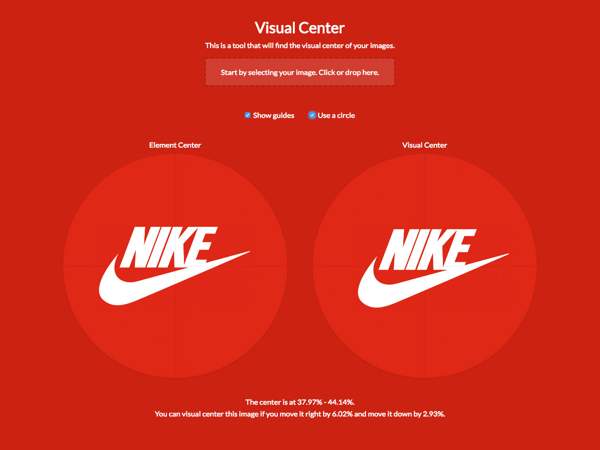

# Visual Center.
This is a tool that will find the visual center of your images.

[](http://javier.xyz/visual-center/)

Why is this important: https://medium.com/@lukejonesme/optical-adjustment-b55492a1165c

## How it works.
It calculates a visual weight value for every pixel on the image: the square root of the difference between that pixel and the background color. And then the algorithm tries to balance that weight in all directions.

Why the square root? http://spectrum.ieee.org/podcast/biomedical/bionics/does-the-brain-work-logarithmically

## Programmatic Usage.

```
npm install visual-center --save
```

```js
const getVisualCenter = require('visual-center')

getVisualCenter(<base64Image>, function(err, result) {
  /*
    results in an object with the data as:
      {
        visualTop: <Visual center for Y axis, from 0 to 1>
        visualLeft: <Visual center for X axis, from 0 to 1>
        bgColor: <The background color that we detected>
        width: <The width of the image>
        height: <The height of the image>
      }
  */
})
```

